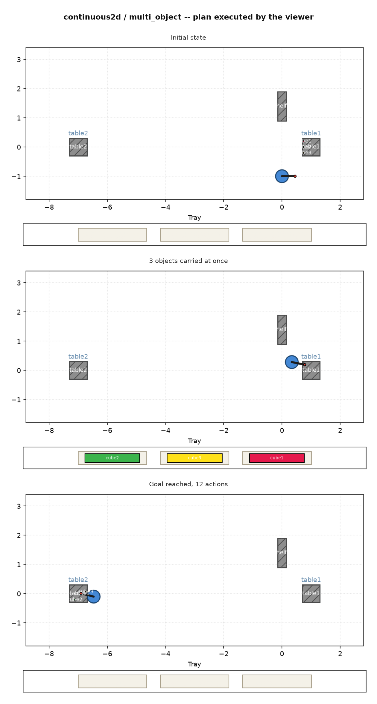
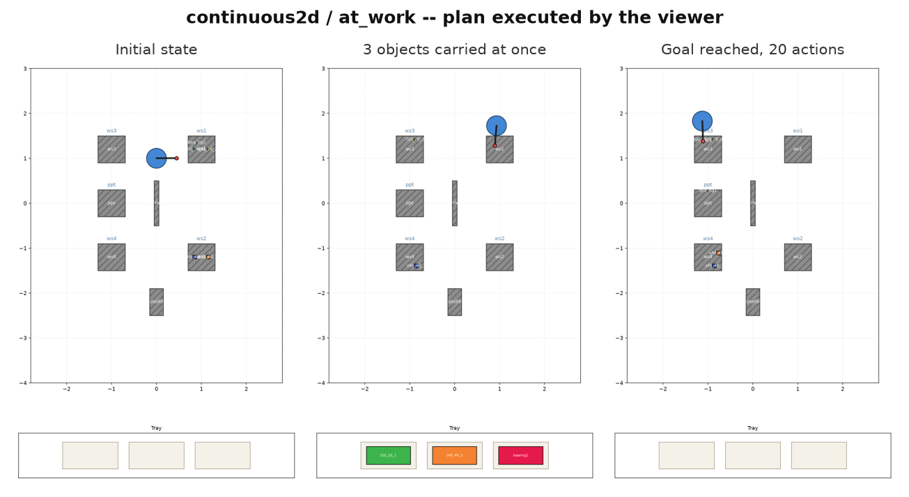
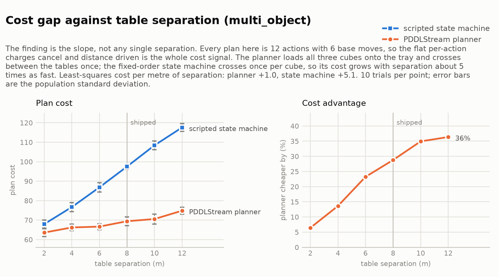

# RoboCup @Work PDDLStream

Development and Evaluation of Sampling-Based Approaches for Integrated Symbolic and
Geometric Planning for Industrial Robots using **PDDLStream**.

This repository contains the implementation developed as part of a Bachelor's thesis.
It applies the original PDDLStream framework to industrial manipulation tasks inspired
by the **RoboCup @Work** competition: a symbolic 2D domain to validate the planning
architecture, and a continuous 2D domain with real geometry — continuous poses, inverse
kinematics, RRT base and arm motion, and collision checking — plus a benchmark harness
that measures the result.

The goal is **not** to modify the PDDLStream algorithm. Nothing under `pddlstream/` or
`downward/` is changed; the contribution is the planning domains, the streams, the
benchmark problems, and the evaluation.



Three cubes must reach a table 8 units away. The planner loads all three onto the
robot's tray and makes one trip, rather than one round trip per cube — the plan shape
the evaluation below is built around.

---

## What is implemented

| | `discrete2d` | `continuous2d` |
|---|---|---|
| Poses | symbolic, from a fixed set | continuous `(x, y)`, sampled by streams |
| Robot | abstract | mobile base `(x, y, θ)` + 2-link arm, 3-slot tray |
| Motion | none | RRT for base and arm, over sampled configurations |
| Collisions | none | base–furniture, arm–object, object–object |
| Action costs | none (`domain.pddl` has no `increase` effects) | base travel + manipulation |
| Scenarios | `pick_place`, `object_transport`, `rearrangement`, `blocked_retrieval` | `pick_place`, `corridor`, `multi_object`, `at_work` |

The continuous domain ships in two variants: `domain.pddl` with separate
`pick`/`stow`/`unstow`/`place` actions, and `domain_merged.pddl` (flag `-ma`), which
fuses them into `pick_and_stow` / `unstow_and_place`. The merged variant is what the
evaluation uses, because it is what makes tray batching a planning decision:
`pick_and_stow` preserves `(CanMoveArm ?r)` so picks chain, while `unstow_and_place`
clears it, forcing a `move_base` between consecutive places.

`at_work` is the full competition-style task, modelled on the Basic Transportation Test
— five industrial parts (`f20_20`, `s40_40`, `bearing`) on two source workstations, two
sorted destination workstations, a precision placement table standing in for the cavity
tray, and a barrier down the middle of the arena that the base has to route around:



---

## Running

Requires Python 3 (developed and measured on 3.12), the packages in `requirements.txt`,
and a compiled Fast Downward:

```bash
python -m venv .venv && source .venv/bin/activate
pip install -r requirements.txt
./downward/build.py            # only needed once; builds downward/builds/release
```

Solve a problem and watch the plan execute in the viewer:

```bash
# symbolic domain -- -p takes any function name from run.PROBLEMS
python -m domains.discrete2d.run
python -m domains.discrete2d.run -p get_pick_and_place_problem --algorithm focused

# continuous domain, merged actions, the multi_object scenario
python -m domains.continuous2d.run -p get_multi_object_problem -ma
python -m domains.continuous2d.run -p get_at_work_problem -ma
```

Useful flags for `domains.continuous2d.run`: `-ma` merged pick/stow actions, `-c`
disable collision checking, `-s` use the hard skeleton, `-wm` world-bound margin,
`--algorithm {incremental,focused,binding,adaptive}`.

The reference examples from the upstream PDDLStream repository are kept unmodified in
`examples/`, as an installation check:

```bash
python -m examples.discrete_tamp.run
```

---

## Evaluation

`evaluations/` is a benchmark harness over the shipped scenarios. Every trial goes
through the same `run.solve_tamp` the CLI calls, so the numbers describe the planner as
actually shipped and not a parallel re-implementation.

```bash
python -m evaluations.run --trials 20      # 7 scenarios x 20 trials, saves results.json
python -m evaluations.plot                 # figures from the saved results
python -m evaluations.sweep --probe        # which algorithm/planner cells are viable
python -m evaluations.sweep --algorithms   # incremental vs focused vs binding vs adaptive
python -m evaluations.sweep --planners     # 10 Fast Downward search configurations
python -m evaluations.baseline             # scripted state machine, same geometry layer
python -m evaluations.separation           # cost gap vs. table separation
python -m evaluations.plot_compare         # figures for all of the sweeps
python -m evaluations.screenshot           # the viewer stills at the top of this file
```

Captured per trial, straight from PDDLStream's own `SolutionStore.export_summary`:
`solved`, `solutions`, `cost`, `length`, `evaluations`, `search_time`, `sample_time`,
`run_time`, `timeout`, plus `iterations`/`complexity` and `skeletons` where the
algorithm reports them. Results land in `evaluations/results/` as `results.json`, CSVs,
markdown tables, and figures (each with a dark-theme twin under `results/dark/` and
`results/sweeps/`). Sweep cells run as killable subprocesses, one at a time, appending
one JSON line per completed trial — so a killed cell keeps its completed trials and
re-running resumes rather than restarting.

### Headline results

n=20 per cell, `adaptive`, merged actions, Fast Downward `ff-astar2`:

| scenario | success | cost | actions | run time (s) |
|---|---|---|---|---|
| discrete2d / pick_place | 20/20 | — | 4 | 0.021 |
| discrete2d / object_transport | 20/20 | — | 4 | 0.023 |
| discrete2d / rearrangement | 20/20 | — | 12 | 0.044 |
| continuous2d / pick_place | 20/20 | 21.83 ± 0.90 | 4 | 0.134 |
| continuous2d / corridor | 20/20 | 22.82 ± 0.85 | 4 | 0.288 |
| continuous2d / multi_object | 20/20 | 69.26 ± 2.14 | 12 | 1.121 |
| continuous2d / at_work | 20/20 | 117.56 ± 2.59 | 20 | 4.446 |

The `discrete2d` cost column is empty rather than zero on purpose: that domain's
`domain.pddl` declares no `increase (total-cost)` effects, so every plan in it costs
0.00 by construction and the number carries no information. Cost is a `continuous2d`
metric only.

**Against a scripted state machine** (`evaluations/baseline.py`) — the fair comparison,
because it reuses the identical geometry layer, is priced by the same cost functions,
and gets the same bounded sampling retries. What it does not get is search over object
ordering:

- `discrete2d/rearrangement`: the script solves **0/20**, the planner 20/20. The goal is
  a true swap, so a fixed-order script has nowhere to put the first object; the planner
  routes through a buffer pose in 12 actions.
- `continuous2d/multi_object`: **97.98 ± 2.15** for the script against **69.26 ± 2.14**
  for the planner, at identical plan length — the script carries one object per trip, the
  planner batches three.
- `pick_place`, `corridor` and `at_work` are ties, and the script is **faster wherever it
  succeeds** (0.250 s vs 1.121 s on `multi_object`). The claim this evaluation supports is
  coverage and plan quality per unit of engineering, not planning speed.

The cost gap is a trend rather than one tuned number. Sweeping how far apart the two
tables sit (`evaluations/separation.py`, n=10 per point) gives a cost slope of **+1.03
per unit for the planner and +5.06 for the state machine** — the state machine pays for
distance about five times over, because it crosses the arena once per object:



### Measured limits

Reported as found, not worked around:

- `incremental` cannot solve any `continuous2d` scenario: Fast Downward's translator
  blows up on the stream-generated object space and never returns. It is killed during
  translation, which is the motivation for lazy TAMP rather than a defect of the harness.
- `focused` reports 0.00 success on `continuous2d`; `binding` solves the two small
  scenarios and hangs on `at_work`. `adaptive` is the only algorithm at 1.00 across all
  four, which is why it is the default. All four solve every `discrete2d` scenario.
- `lmcut-astar` finds no plan on `continuous2d` at all: LM-cut does not support axioms,
  and the domain derives `(In ?o ?reg)`.
- Every `SEARCH_OPTIONS` template in PDDLStream runs at `cost_type=PLUSONE`, so the
  search minimises cost-plus-one-per-action. The search-configuration comparison is a
  cost/time tradeoff and **no** configuration in it is a ground-truth optimum.
- `adaptive` persists stream statistics per domain (`statistics/py3/*.pkl`), so trials
  are not independent draws and absolute costs shift a few units between campaigns. Every
  table in `results/` comes from a single contiguous campaign; slopes reproduce, offsets
  drift.

---

## Repository structure

```text
pddlstream-robocup-at-work/
├── pddlstream/            # upstream PDDLStream framework, unmodified
├── downward/              # Fast Downward, unmodified (build once)
├── examples/              # upstream reference examples, as an install check
│   ├── discrete_tamp/
│   └── continuous_tamp/
├── domains/
│   ├── discrete2d/        # domain.pddl, stream.pddl, primitives, viewer, problems/
│   └── continuous2d/      # + domain_merged.pddl (-ma), RRT motion, collisions
├── evaluations/
│   ├── run.py             # the headline metric sweep
│   ├── scenarios.py       # scenario registry, ordered by complexity
│   ├── metrics.py         # per-trial capture
│   ├── sweep.py           # algorithm / search-config sweeps, as killable subprocesses
│   ├── worker.py          # one sweep cell, one process
│   ├── baseline.py        # the scripted state machine
│   ├── separation.py      # cost gap vs. table separation
│   ├── plan_shape.py      # tray peak and base travel of a plan
│   ├── plot.py            # headline figures
│   ├── plot_compare.py    # sweep figures
│   ├── screenshot.py      # viewer stills for the write-up
│   └── results/           # results.json, CSVs, tables, figures (+ dark/, sweeps/)
├── statistics/            # PDDLStream's persisted per-domain stream statistics
├── temp/                  # generated translator output (do not edit)
└── docs/
```

---

## Thesis

> Development and Evaluation of Sampling-Based Approaches for Integrated Symbolic and
> Geometric Planning for Industrial Robots

Bachelor's Thesis.

Roadmap beyond this repository's scope: extending the continuous domain to full 3D
manipulation, with a physics simulator (PyBullet or Gazebo) and ROS 2 integration.

---

## Acknowledgements

Built upon the **PDDLStream** framework by Caelan Garrett and collaborators, and **Fast
Downward** by Malte Helmert and contributors. Both are vendored unmodified; this work
adds the RoboCup @Work domains, the benchmark problems, and the evaluation.
